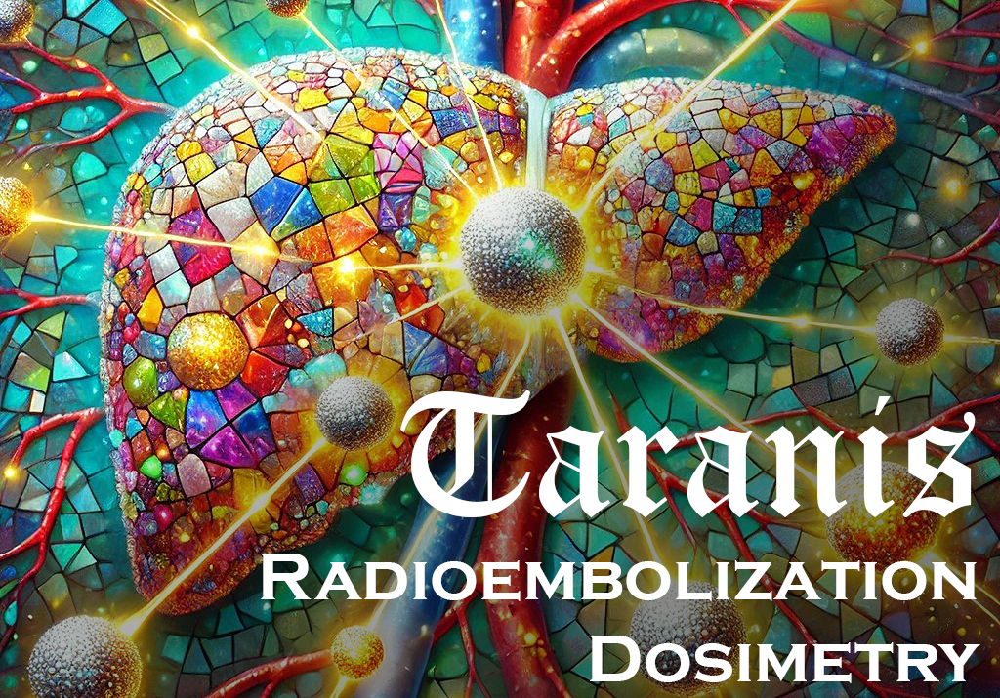
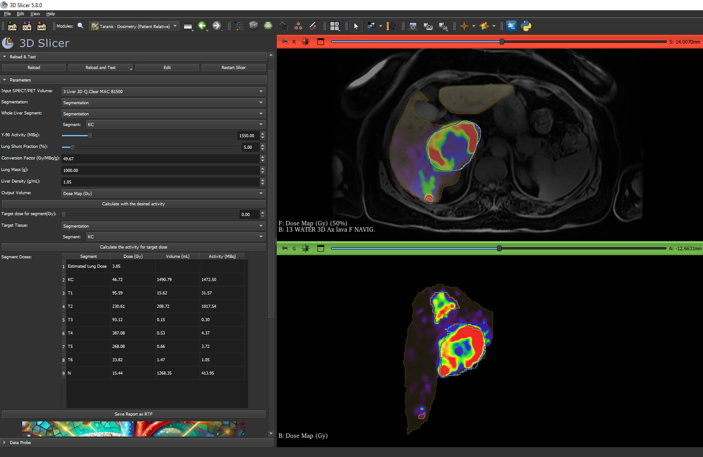
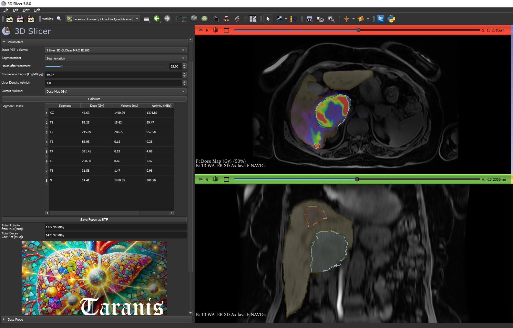

# Taranis: Open-Source Dosimetry Suite for Radioembolization

**Taranis** is an open-source suite of Python modules for voxel-based liver radioembolization dosimetry, developed for use within [3D Slicer](https://www.slicer.org/). 

It enables lung shunt fraction estimation, predictive dose planning, and post-treatment quantification using PET or SPECT images. Taranis is designed for researchers and developers exploring personalized dosimetry workflows.

Sample images to test the modules can be found in here: https://github.com/4burakfe/SlicerRadioembolizationDosimetry_SampleImages/releases/tag/TestImages

> ⚠️ **This software is not a certified medical device. It is intended for research purposes only.**

## 📦 Modules Included

All modules are available under `Nuclear Medicine` category.

- `LSF Calculator`: Lung Shunt Fraction Calculator
- `Taranis - Dosimetry (Patient Relative)`: Patient-relative predictive dosimetry
- `Taranis - Dosimetry (Absolute Quantification)`: Post-treatment absolute quantification dosimetry
- `EasyReg`: Registration of SPECT/CT to diagnostic CT/MRI

---

## 📖 User Manual

### 📌 LSFcalc – Lung Shunt Fraction
**Purpose**: Estimate lung shunt fraction before treatment using labeled segmentations and SPECT/PET imaging.

**Steps**:
1. Load SPECT or PET volume.
2. Import or create segmentation containing "Liver" and "Lungs" segments.
3. Select input volume and segmentation.
4. Choose segment IDs for Liver and Lung.
5. Click **Calculate**.
6. View counts and LSF result in UI.

### 📌 RadioembolizationDosimetry – Patient Relative
**Purpose**: Predict dose distributions using known activity and user-defined physical parameters.

**Steps**:
1. Load SPECT/PET image and liver segmentation.
2. Define:
   - Administered activity (MBq)
   - Lung shunt fraction (%)
   - Liver tissue density (g/mL)
   - Lung mass (g)
   - Conversion factor (Gy/MBq/g)
3. Select "Whole Liver" segment.
4. Choose output volume for dose map.
5. Click **Calculate**.
6. View dose overlay and segment statistics.
7. Optional: Choose "Target Segment" and input a **Target Dose** to back-calculate required activity.
8. Export results as **RTF report**.

### 📌 RadioembolizationDosimetryabs – Absolute Quantification
**Purpose**: Estimate absorbed dose from post-treatment PET/SPECT images using decay correction.

**Steps**:
1. Load post-treatment PET/SPECT image and segmentation.
2. Input:
   - Hours since treatment
   - Physical half-life of radionuclide (e.g., 64.2 h for Y-90)
   - Liver density and conversion factor
3. Select output volume.
4. Click **Calculate**.
5. View dose map and segment-wise results.
6. Export results as **RTF report**.

### 📌 easy_reg – SPECT/CT to Diagnostic CT/MRI Registration
**Purpose**: Provide an easy workflow to register SPECT/CT to diagnostic CT or MRI.

**Steps**:
1. Load SPECT and corresponding CT volume.
2. Load or create ROI around liver region.
3. Select registration method:
   - Rigid
   - Affine
   - Deformable (BSpline)
4. Click **Register Images**.
5. Registration results are automatically visualized with overlay and appropriate colormaps.

---

## 🧮 Key Assumptions
- **Local dose deposition model** (no voxel-S or Monte Carlo used)
- No biological modeling (e.g., BED)
- Not intended for clinical deployment

---

## 🤝 Contributions
Pull requests, feature suggestions, and issue reports are welcome! Please open an issue or discussion thread to get started.

## 📜 License
Taranis is released under the **MIT License**.

This module is NOT a medical device. It is for research purposes only.
Developed by: Burak Demir, MD, FEBNM
For support, feedback, and suggestions: 4burakfe@gmail.com
