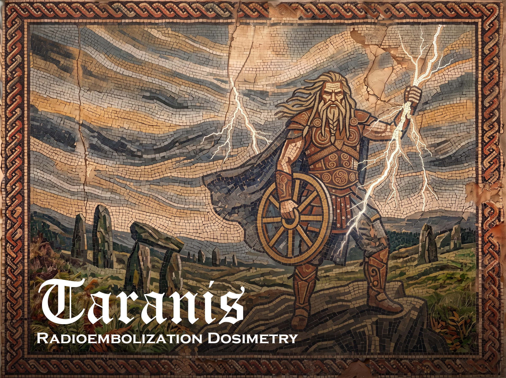
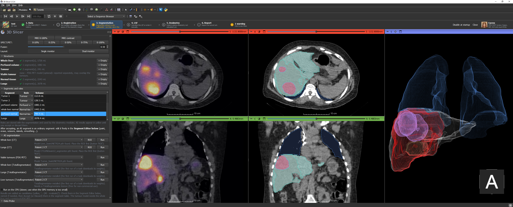
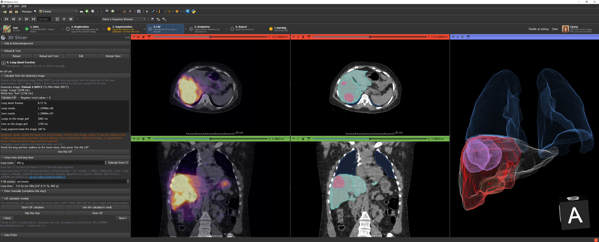
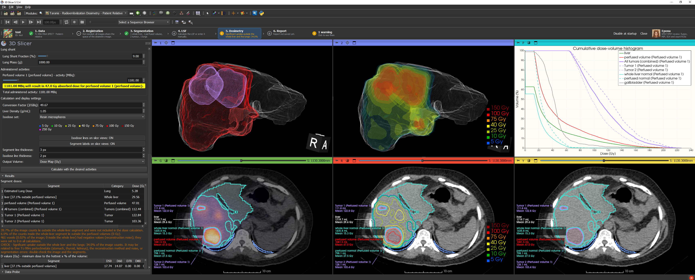
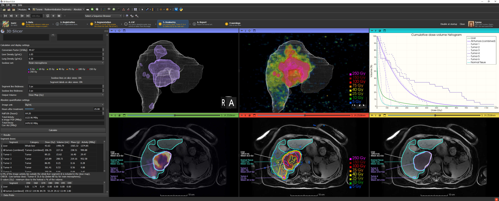

# Taranis: Open-Source Dosimetry Suite for Radioembolization

**Taranis** is an open-source suite of Python modules for voxel-based liver radioembolization dosimetry, developed for use within [3D Slicer](https://www.slicer.org/) (5.x).

It enables lung shunt fraction estimation, predictive dose planning with multiple perfused volumes, and post-treatment quantification using PET or SPECT images, with dose-volume histograms, isodose visualization, annotated slice views and exportable reports. Taranis is designed for researchers and developers exploring personalized dosimetry workflows.

Sample images to test the modules can be found in here: https://github.com/4burakfe/SlicerRadioembolizationDosimetry_SampleImages/releases/tag/TestImages
(they are also available in the **Sample Data** module under the `RadioembolizationDosimetry` category: *RadioembolizationDosimetry1* = MRI + Y-90 PET for the absolute module, *RadioembolizationDosimetry2* = CT + SPECT for the patient-relative module).

> ⚠️ **This software is not a certified medical device. It is intended for research purposes only.**

## 📦 Modules Included

All modules are available under `Nuclear Medicine` category.

- `Taranis`: the hub. Welcomes you, manages the case (name and ID) and guides the whole workflow; adds the **workflow toolbar**
- `LSF Calculator`: Lung Shunt Fraction Calculator
- `Taranis - Patient Relative Dosimetry`: Predictive dosimetry (e.g. Tc-99m MAA SPECT) with one or more perfused volumes
- `Taranis - Absolute Dosimetry`: Post-treatment dosimetry from quantitative PET/SPECT (e.g. Y-90 PET)
- `EasyReg`: Registration of SPECT/CT to diagnostic CT/MRI

> ℹ️ The combined `Taranis - Dosimetry` module has been split into `Taranis - Patient Relative Dosimetry` and `Taranis - Absolute Dosimetry`, so that the patient-relative module can support complex treatment plans with multiple perfused volumes. Both modules share the same results layout, segment categories, tables and report.

---

## 📖 User Manual

### 📌 Taranis – workflow hub and toolbar
**Purpose**: Run a complete case in six steps and always see where you are. The step modules below still work on their own.

**Workflow toolbar** (top of the Slicer window):
- The first time you open *Taranis* the toolbar is added; from then on it appears at every Slicer start.
- Without a case it shows one button, **Start TARE dosimetry workflow**.
- With a case: case name and ID, the steps **Data › Registration › Segmentation › LSF › Dosimetry › Report** with a status badge each (✓ done, ! done with warnings, ✕ error, ↻ outdated, » skipped, – not needed / waiting), and an issue counter whose menu jumps to the step concerned. Hover a step for its details.
- At the far right, **Epona – SPECT/PET Review** (from the SlicerPETDenoise extension) opens the fusion / MIP / SUV-ROI review module to explore the images of a case.
- It adapts to the window width: on smaller screens the explanation lines are dropped and the steps get narrower, then *Disable at startup* and *Close* move into a **⋯** menu, and finally the steps show only their badge (hover for the details) – Epona stays visible.
- **Close** hides it for this session. **Disable at startup** stops showing it when Slicer starts: it then appears only when a case is started or resumed, and disappears when the case (scene) is closed.
- Gating is soft: every step can be opened and skipped. Errors are only raised when a calculation would be impossible or wrong.

**Steps**:
1. **Data and roles**: start a case (name and ID, pre-filled from DICOM), load images (DICOM browser, Add data, sample data) and assign roles. *Suggest roles* uses DICOM tags (modality, radiopharmaceutical, units, frame of reference, dates) or, without DICOM, names and image values. Required: the dosimetry image (Tc-99m MAA SPECT, Y-90 SPECT or Y-90 PET) and one anatomical image (its own CT/MRI or a reference CT/MRI). Optional: reference CT/MRI, metabolic PET (FDG, DOTATATE) and its CT/MRI. Choose the processing mode: patient-relative (all images) or absolute (Y-90 only, post-therapy), the microsphere type and the administration time.
2. **Registration**: a registration plan is made from the roles. The primary space is the reference image if present, otherwise the dosimetry image's CT/MRI. Hybrid pairs are registered anatomy-to-anatomy with EasyReg; a SPECT without its own CT is aligned manually for now. Images with the same DICOM frame of reference need nothing. The step can be skipped (e.g. only Y-90 PET/CT or MAA SPECT/CT).
3. **Segmentation**: its own layout – axial and coronal fusion (anatomy + SPECT/PET) and axial and coronal reference image with the segments, plus a tall 3D view with the segments as wireframes (as in the dosimetry modules). With two screens (or the **Dual monitor** button in *Display windowing*) the four slice views fill the main window and the 3D view opens in its own window on the second screen; the Single / Dual monitor choice is shared with the dosimetry modules. Slicer's Segment Editor is embedded in the page, below a Taranis panel:
   - **Checks while you work** (toolbar and the pop-up on *Next*; warnings, never blocking): whole liver < 500 mL or > 4500 mL, perfused volume < 100 mL, no tumour (dosimetry still possible for the other segments), no normal tissue, empty segments, segments without a role, duplicate segment names, AI results not accepted yet; small tumours (< 2 mL, partial volume) as a note.
   - **Structures**: whole liver, perfused volume(s), tumours, viable tumours (default role of the FDG-PET tumour model; may overlap tumours), normal tissue and lungs with their volumes; "+ Empty" adds a segment with that role.
   - **Segments and roles**: role and volume of every segment; roles are stored with the segmentation and fill the dosimetry modules' segment categories.
   - **AI segmentation**: every result arrives as a yellow candidate "… (AI - evaluate)"; review it in the editor, then *Accept* (it gets its role and colour; an existing liver/lung segment can be replaced) or *Discard*.
     - Taranis models: whole liver (CT) and lungs (CT) run inside an **ROI** around the organ (button *ROI*, then adjust it); FDG-PET tumours run inside the whole liver (the PET is converted to SUV from its DICOM header).
     - TotalSegmentator (extension): whole liver on CT or **MRI**, lungs, and **liver tumours on CT or MRI** (tasks *liver_lesions* / *liver_lesions_mr*, which need a TotalSegmentator licence, free for non-commercial use).
     - Missing Taranis models can be downloaded with the *Download* button (release *Trained_Models* of SlicerAether, SHA256-checked) or taken from the AI models folder.
   - **Tools**: normal liver = liver − tumours; perfused normal = perfused − tumours (one segment per perfused volume, used for the tumour-to-normal ratio of the dose checks); perfused volume from the uptake of the dosimetry image (voxels of the liver above a percentage of the robust maximum, default 5 % – an empirical starting point, review every result; created as a candidate); **geometry check** (overlaps, parts outside the liver, tumours not or only partly (> 10 %) inside the perfused volumes, tumour burden > 50 % of the liver, normal tissue that no longer matches liver − tumours, short lungs) – its findings appear on the toolbar until the segments change, and it runs automatically on *Next*, with a pop-up listing every error and warning of the step (continuing is always possible). Clipping to the liver and splitting into lesions are done with the Segment Editor (Logical operators, Islands). Segments may overlap: the embedded editor always uses *Allow overlap*. Every segment is kept on its own labelmap layer (a new segment never carves the whole liver). Slicer's *Fill between slices* interpolates all visible segments together and cannot handle overlapping ones, so while it is the active effect only the selected segment is shown; the others come back when you leave the effect. The 3D view re-centres when a new segment appears.
4. **Lung shunt fraction**: the segmentation layout stays on to check the segments.
   - *Calculate from the dosimetry image*: counts of the MAA SPECT in the lung segment(s) and the whole liver of the case (voxels claimed by both count for the liver), with a check that the lungs are inside the SPECT field of view. *Use this LSF* stores it in the case; if the image or the lung / liver segments change later, the step becomes *Outdated*.
   - *Lung mass and lung dose*: default 1000 g, or *Estimate from CT* (CT densitovolumetry: density = (CT number + 1000)/1000 g/mL × lung volume, as in Kao YH et al., EJNMMI Res 2014;4:33, doi:10.1186/s13550-014-0033-7). With the Y-90 activity, the estimated lung dose (49.67 Gy·kg/GBq) is shown and checked against the commonly used 30 Gy per session / 50 Gy cumulative limits.
   - Or enter the LSF manually (planar, other software, pre-therapy value), or use the stand-alone LSF calculator. Not used in absolute mode.
5. **Dosimetry**: opens the patient-relative or absolute module with the case's images, segmentation, whole liver, perfused volumes, LSF, lung mass and isodose set filled in. The module stays fully editable and a **review box** at its top lists what was filled in; values that need checking are highlighted until changed or confirmed with *Checked*:
   - *Absolute*: **hours after treatment** from the administration time (Data step) and the image's DICOM header (decay-correction reference: series start for START, acquisition start if the series was reconstructed later or the image is not decay-corrected, 0 h for ADMIN). The scanner's own injection time is compared with the administration time. Always check it: scanner clocks, later reconstructions and vendor-specific decay correction change the value.
   - *Patient-relative*: the activity entered in the LSF step, when there is one perfused volume.
   After each calculation the **dose checks** list what needs a second look (high normal tissue dose, low tumour dose, low tumour-to-normal ratio, high LSF or lung dose, uptake outside the liver and lungs or outside the perfused volumes, hours after treatment left at 0; see *Guardrails and checks*): in a dialog, under the results, in the report and on the toolbar. They are warnings only.
   The step becomes *Outdated* if images, registration or segments change after the calculation.
6. **Report**: case summary with every warning; saves the dosimetry module's RTF report and the scene.

*Segmentation step*: fusion and reference views, 3D view with the lungs, segment roles, AI segmentation and tools.

*LSF step*: lung shunt fraction from the MAA SPECT counts, lung mass from the CT and the estimated lung dose.

**Views of the modules**: EasyReg, the segmentation step, the LSF calculator and the dosimetry modules each switch to their own layout when opened, with their own view nodes, and keep the renderings of other modules out of them (e.g. the Epona MIP does not appear in the dosimetry 3D views, and isodose / segment models do not appear in the Epona MIP view). Segment work in the Segmentation step is done on a grid that covers all case images, so e.g. SPECT/CT lungs above a liver MRI are not cropped.

**Settings** (Taranis module): toolbar at startup, and the **AI models folder** (searched first by the Segmentation step and the LSF calculator; then the Taranis download folder and the LSF calculator's folder).

**Memory** (Taranis module, Home page): *Memory report* lists what uses Slicer's RAM (process memory, the largest images, segmentations and models of the scene, temporary nodes left behind, arrays kept by the modules; also written to the Python console). *Free memory* removes temporary nodes left behind by interrupted operations, clears the Taranis caches, collects Python garbage and returns unused memory to the system; your data is not changed. Memory is also saved automatically: the hub's segmentation tools and geometry check work on a grid around the segments only (not on whole CT / SPECT volumes), the embedded Segment Editor lets go of its undo history and working images outside the Segmentation step, segment surfaces are shared instead of copied for the slice labels, temporary label maps are removed together with the colour table Slicer makes for them, and garbage is collected after heavy operations.

### 📌 LSFcalc – Lung Shunt Fraction
**Purpose**: Estimate lung shunt fraction before treatment using labeled segmentations and SPECT/PET imaging.

**Steps**:
1. Load SPECT or PET volume.
2. Import or create segmentation containing "Liver" and "Lungs" segments.
3. Select input volume and segmentation.
4. Choose segment IDs for Liver and Lung.
5. Click **Calculate**.
6. View counts and LSF result in UI.

### 📌 Taranis - Patient Relative Dosimetry
**Purpose**: Predictive voxel-based dosimetry before treatment. The activity planned for each perfused volume (vascular territory of an injection position) is distributed inside that perfused volume in proportion to image counts, and the dose maps of all perfused volumes are added.

#### 1. Images and segments
- **Input SPECT/PET Volume** (e.g. Tc-99m MAA SPECT)
- **Set negative voxel values to 0** (on by default, see [Negative voxel values](#negative-voxel-values))
- **Reference Volume (CT/MRI)**: anatomical image shown under the isodose lines
- **Master Segmentation**: every segment selection in the module uses this segmentation, so only the segment has to be chosen
- **Whole Liver Segment**

#### 2. Perfused volumes
- Select at least one **perfused volume** segment. Click **Add perfused volume** for more; perfused volumes 2, 3, … have a **Remove** button (later ones are renumbered).
- Perfused volumes **must not intersect** each other and **must lie entirely inside the whole-liver segment**. Tumors must also lie inside the whole liver.
- Violations stop the calculation with a list of the offending segments and the overlapping/outside volume in mL. Fix them in the Segment Editor (e.g. *Logical operators > Intersect* with the whole liver, or *Masking > Editable area* inside the whole liver).

#### 3. Segment categories
See [Segment categories and colours](#segment-categories-and-colours). The whole liver and the perfused volumes are not offered for categorization.

#### 4. Lung shunt and activities
- **Lung Shunt Fraction (%)** and **Lung Mass (g)** (default 1000 g): one set for the whole treatment, applied to the activity of every perfused volume.
- **Administered activities**: one slider per perfused volume, labelled with its number and segment name (e.g. *Perfused volume 2 (Left lobe) - activity (MBq)*). The total administered activity is shown below.
- **Live dose estimate**: under each slider a single-compartment estimate updates immediately, e.g. *"1500.00 MBq will result in 118.3 Gy absorbed dose for perfused volume 1 (Right lobe)."*
  - D [Gy] = A [MBq] × (1 − LSF) × CF [J/GBq] / (ρ [g/mL] × V [mL]), with V the volume of the segment.
  - The label is coloured with the isodose colour of the level the dose reaches (current isodose set); neutral below the lowest level.
  - It equals the mean dose of the perfused volume in the voxel-based calculation.

#### 5. Calculate
Click **Calculate with the desired activities**.

- For each perfused volume: D_i = A × (1 − LSF) × (c_i / Σ c in the perfused volume) × CF / (ρ × V_voxel); the per-volume dose maps are then added.
- If more than **10 %** of the counts inside the whole liver lie outside all perfused volumes, you are warned and can go back to adjust the segments or continue anyway.
- **Estimated lung dose** = total administered activity × LSF × CF / lung mass.

> ⚠️ **Patient-relative dosimetry ignores extrahepatic uptake and non-perfused liver.** Voxels outside the perfused volumes get 0 Gy. Segments lying partly outside the perfused volumes are flagged in the tables (fully outside = "not modelled"). The fraction of image counts outside the whole liver and of whole-liver counts outside the perfused volumes are reported.

In the results, segments are tagged with the perfused volume(s) they belong to or overlap, e.g. *Right lobe (Perfused volume 1)* or *Tumor 3 (Perfused volumes 1, 2)*.

### 📌 Taranis - Absolute Dosimetry
**Purpose**: Post-treatment voxel-based dosimetry from a quantitative activity-concentration image (local energy deposition in every voxel of the image, including extrahepatic uptake).

**Locked without a quantitative image**: *Calculate* is disabled, with the reason shown above it, unless
- with a Taranis case in the scene: the input is the case's dosimetry image, its type allows absolute dosimetry (Y-90 PET, or calibrated Y-90 SPECT; never MAA SPECT) and it is not in counts or SUV;
- without a case: the image carries activity-concentration units (Bq/mL) in its metadata. An image without metadata (e.g. loaded from a NRRD file) can be used by assigning it as the dosimetry image of a Taranis case.

#### 1. Images and segments
- **Input quantitative PET/SPECT** (e.g. Y-90 PET)
- **Set negative voxel values to 0** (on by default, see [Negative voxel values](#negative-voxel-values))
- **Reference Volume (CT/MRI)**, **Master Segmentation** and **Whole Liver Segment** (used for display and QC only; the dose is calculated for the whole image)

#### 2. Segment categories
See [Segment categories and colours](#segment-categories-and-colours). The whole liver is not offered for categorization.

#### 3. Absolute quantification settings
- **Image unit** (Bq/mL, kBq/mL or MBq/mL; pre-selected from image metadata when available — SUV images are not supported)
- **Hours after treatment**: time from administration to the time the image is decay-corrected to (usually scan start). Set 0 if the image is already decay-corrected to administration time. Filled in (to be checked) when the module is opened from the Taranis workflow with a known administration time.
- **Half-life (hours)**: 64.2 h for Y-90 (default); for reference 26.8 h for Ho-166 and 17.0 h for Re-188
- Click **Calculate**. Total activity in the image field of view (at scan time and decay-corrected) is displayed, and the fraction of image activity outside the whole liver is reported.

---

### 📌 Features shared by both Taranis modules

#### Segment categories and colours
- The **Segment categories** box shows the remaining segments on the left (*Uncategorized*) and boxes on the right: **Tumors**, **Viable tumors**, **Normal tissue**, **Lungs**, **Others** and **Ignored**.
- **Viable tumors** are handled like tumors but reported separately (own combined row *All viable tumors*); they may overlap tumor segments.
- **Lungs**: not calculated in the patient-relative module (the lung dose comes from the lung shunt). In the absolute module they are calculated with the **lung density**; a pop-up warns that lung doses are less reliable and offers to estimate the density from the CT (mean of (CT number + 1000)/1000 in the lungs).
- **Ignored** segments are left out of all calculations and are not recoloured. Select segments and move them with the **>** and **<** buttons next to each box (multiple selection is supported).
- Categories are stored on the segmentation node, so they are saved with the scene and shared by both modules.
- Standard colours are applied to the segments at calculation (this overwrites the segments' own colours):

| Segment | Colour |
|---|---|
| Whole liver | white |
| Perfused volumes (patient relative) | bright red |
| Tumors | lavander |
| Viable tumors | bright maroon (#c32148) |
| Lungs | light blue |
| Normal tissue | turquoise |
| Others and uncategorized | gray |

#### Calculation and display settings
- **Conversion Factor (J/GBq)**: 49.67 for Y-90 (default); for reference 15.87 for Ho-166 (60 Gy for 3.78 GBq/kg) and about 10.8 for Re-188 (mean beta energy ~0.76 MeV). A value other than the Y-90 default (or, in the absolute module, a half-life other than 64.2 h) is shown in orange under the field and becomes a dose-check warning: the Y-90 microsphere types and dose thresholds may not apply.
- **Liver Density (g/mL)**: default 1.05
- **Lung Density (g/mL)** (absolute module): default 0.30, used for the lung voxels outside the whole liver; *Estimate lung density from CT* is offered when lungs are categorized
- **Isodose set**: *Glass microspheres* or *Resin microspheres* (see below)
- **Isodose lines on slice views** and **Segment labels on slice views**: ON/OFF buttons
- **Segment line thickness** (default 3 px) and **Isodose line thickness** (default 2 px) in the slice views, applied immediately
- **Output Volume**: dose map in Gy. If none is selected, a new one is created automatically.

#### Negative voxel values
Some reconstructions produce negative voxel values (noise). With **Set negative voxel values to 0** ticked (default), negative values are set to 0 once, when the image is read, so the dose map, totals, QC fractions and statistics are all calculated from the same values. The loaded volume itself is not modified. The number of negative voxels (in the image and inside the whole liver) is reported in the results and the report either way. Unticked, negative values are used as is and produce negative voxel doses.

#### Results layout
After calculation the view layout switches to 3 columns × 2 rows:

| | Left | Middle | Right |
|---|---|---|---|
| **Top** | 3D view: whole liver, perfused volumes and tumors as wireframe models | 3D view: whole liver + isodose surfaces | Cumulative dose-volume histogram |
| **Bottom** (axial) | Reference volume fused with PET/SPECT (Inferno) | Reference volume with isodose lines and legend | Reference volume |

- **3D segment models** (top left): whole liver (opacity 0.03), perfused volumes (0.05) and tumors (0.10) only; normal tissue and other segments are shown in the slice views only.
- The two 3D views are synchronized: rotating, zooming or panning one moves the other.
- The three axial views are linked (scrolling, zooming and panning move all three) and are centred on the reference volume with a 300 mm field of view.
- Segment outlines (faint fill) are shown in all three axial views.
- **Segment labels**: segment names are shown at the left and right edges of the slice views with leader lines pointing to each segment on the current slice. They follow scrolling, zooming and panning, never overlap, and stay clear of the isodose legend.
- Hovering in the middle axial view shows the dose value (Gy) in the Data Probe.

**DVH**: each curve uses its segment's colour; the whole liver is **green** (white is invisible on the plot). Segments with the same colour (e.g. several tumors) get different line patterns (solid, dash, dot, dash-dot, …); *All tumors (combined)* is a thicker line.

**Isodose levels** (same colour order for both sets: blue, green, green-gold, yellow, orange, vibrant red, dark red, magenta)

| Set | Levels (Gy) |
|---|---|
| Glass microspheres | 10, 20, 50, 75, 120, 200, 300, 400 |
| Resin microspheres | 5, 10, 25, 40, 75, 100, 150, 250 |

Only levels reached in the dose map are drawn and listed in the legend. Changing the isodose set after a calculation updates the isodose surfaces without recalculating.

#### Result tables
- **Segment doses**: segment, category, mean dose (Gy), volume (mL), mass (g) and activity (MBq), ordered by category: whole liver, perfused volumes, tumors (combined), tumors, normal tissue, others, uncategorized (plus the estimated lung dose in the patient-relative module)
- **All tumors (combined)**: calculated on the union of all tumor segments (overlaps counted once) whenever at least one tumor is categorized; also included in the D/V tables, DVH and custom metrics
- **D values**: D50, D60, D70, D80, D90, D95, D99 (Gy) — minimum dose received by the hottest x % of the segment volume
- **V values**: V30, V40, V50, V60, V70, V80 (%) — percentage of the segment volume receiving at least x Gy
- **Custom DVH metrics**: tick segments, choose a D (x %) or V (x Gy) metric and click **Compute**; V results are given in % and mL

#### Report
Click **Save Report as RTF** or **Save Report as PDF** to export the **last calculation** (not the current, possibly changed, UI values). The report starts with the **patient name and ID** (DICOM header of the dosimetry image, otherwise the Taranis case), the Taranis case and the **imaging dates** of the dosimetry and reference images when available. It has the same tables as the module: parameters, segment doses (segment, category, dose, volume, mass, activity), D values, V values and custom DVH metrics, followed by the QC notes. The PDF is written with Qt (part of Slicer, no extra library); the button only appears when the Slicer build supports it. The Taranis Report step offers both formats too. **Export Table (TSV)** saves the segment doses of the last calculation (segment, category, dose, volume, mass, activity) with their D and V values side by side, one line per segment, as a tab-separated file for spreadsheets or statistics (UTF-8, decimal point).

At the end of the report, **screenshots of all six views** (both 3D views, the DVH and the three axial views) are added as separate captioned images. They are taken when the report is saved, so they show the views as you left them.

Models, isodose surfaces and DVH nodes are stored in the Data module folders *Taranis segment models*, *Taranis isodose surfaces* and *Taranis DVH*, and are replaced on the next calculation.

### 📌 easy_reg – Registration to the reference CT/MRI
**Purpose**: Bring the SPECT/PET into the space of the diagnostic CT or MRI. Two paths:

**Bed position**: under the image selectors, **Centre moving image on reference** moves the moving image (the CT of the SPECT/CT, or the SPECT/PET itself) so that the centres of the two fields of view coincide – a quick first step when the scans have very different bed positions (nothing is resampled; it does not count as a registration in the Taranis workflow). **Reset to original position** removes EasyReg's transform and returns the images and landmarks to where they were.

**SPECT/CT or PET/CT → reference (anatomy to anatomy)**
1. Select the CT of the hybrid scan (moving), the SPECT/PET (follows the CT) and the reference CT/MRI (fixed).
2. Optional: ROIs around the liver (only temporary copies are cropped).
3. Method: Rigid or Affine, then **Register**. (Deformable B-spline registration was removed: far too slow and memory-hungry – over 10 GB even at 0.2 % sampling.)
4. Check the 4 × 2 fusion layout, then **Harden transform** (or Undo / fine-tune).
5. **◀ Previous**, **Registration overview** and **Next ▶** return to the Taranis workflow (Data step, the case's registrations, Segmentation step); *Next* asks for confirmation if the transform is not hardened yet.

**SPECT or PET only → reference (no CT of its own)** – functional-only
1. Select the SPECT/PET (moving) and the reference. For the liver-based steps select the segmentation drawn on the reference and its whole-liver segment.
2. Initial alignment (any combination):
   - **Align body outlines**: centres the SPECT/PET body outline (scatter/background, threshold in % of the maximum) on the reference body outline; with a liver segment, the uptake centre is placed on the liver centre (head-feet). With lobar or selective injections the uptake is not centred in the liver: check and correct.
   - **Landmarks**: place at least 3 pairs in the same order (R1… on the reference, S1… on the SPECT/PET), e.g. liver dome, porta hepatis, focal uptake ↔ tumour, stomach or kidney activity. The rigid fit reports the RMS distance; the SPECT/PET landmarks move with the image.
   - **By hand**: move/rotate handles in the views, or the Transforms module sliders.
3. Optional **Refine rigidly inside the liver**: mutual-information rigid registration restricted to the liver segment grown by a margin (default 20 mm), starting from the current alignment. If it moves the liver region by more than 20 mm or 10° you are warned. Affine and deformable registration are not offered on this path.
4. The 3 × 2 layout shows reference, SPECT/PET alone and SPECT/PET on reference (axial and coronal). Harden or undo as above. The workflow marks the step as functional-only (warning: verify visually).

---

## 🛡️ Guardrails and checks

Taranis warns rather than blocks (*soft gating*): every step can be opened, skipped and continued. **Errors** mark
what would make a calculation impossible or wrong; **warnings** ask for a check; **notes** give context. A few
checks are hard stops inside a module (the calculation is refused, or a button is locked) and a few ask for
confirmation.

Where they appear:
- **Toolbar**: badge of each step (✕ error, ! warning, ↻ outdated) and the issue counter with all errors and warnings.
- **Pop-up on *Next*** in the Segmentation step: every error and warning of the step, with *Stay and fix* / *Continue anyway*.
- **Module dialogs**: messages, confirmations and locks inside EasyReg, the LSF step and the dosimetry modules.
- **Dose checks** after a dosimetry calculation: one dialog with all warnings, the note under the results, the report
  notes, and the Dosimetry badge on the toolbar.

Levels: **E** error · **W** warning · **N** note · **Stop** calculation refused · **Lock** button disabled ·
**Ask** confirmation. Thresholds are constants in the code (named in *italics*) so they can be changed in one place.

### 1. Data (workflow validator, `workflow.evaluateData`)
| Condition | Level |
|---|---|
| No image assigned / no dosimetry image | E |
| Dosimetry image type not selected | E |
| Processing mode not possible for the image type (e.g. absolute with MAA SPECT) | E |
| Absolute mode with a dosimetry image in SUV or in counts | E |
| Absolute mode, image units unknown | W |
| Absolute mode with Y-90 SPECT (valid only with a calibrated quantitative reconstruction) | W |
| No anatomical image (neither the dosimetry image's CT/MRI nor a reference) | E |
| One image assigned to several roles | E |
| CT/MRI type of an anatomical role not selected | W |
| Dosimetry image and its CT/MRI in different DICOM frames of reference | W |
| No CT/MRI acquired with the dosimetry image, only a reference (functional-only registration) | W |
| Metabolic image without its CT/MRI / metabolic type not selected | W |
| CT/MRI for a metabolic image but no metabolic image | N |
| Reference or metabolic image acquired more than *studyIntervalLimitDays* (60) days from the dosimetry image | W |

### 2. Registration (workflow validator + EasyReg)
| Condition | Level |
|---|---|
| Registration skipped although an image is not in the primary space | W |
| An image that should follow the registration (e.g. the SPECT of a SPECT/CT) does not follow it | W |
| Functional-only registration (SPECT/PET without its own CT): verify the alignment | W |
| Registrations still to do | N |
| EasyReg: moving and reference are the same image / inputs missing | Stop |
| EasyReg: reference image under a transform, moving image under a deformable or nested transform | Stop |
| EasyReg: liver refinement without an initial alignment | Ask |
| EasyReg: liver refinement moved the liver region more than *REFINE_WARNING_MM* (20 mm) or rotated more than *REFINE_WARNING_DEGREES* (10°) | W (dialog) |
| EasyReg: body outline not usable and no liver segment selected | Stop (with advice) |
| EasyReg: hardening a non-rigid transform (resamples the quantitative SPECT) | Ask |
| EasyReg: *Next* while the registration is not hardened | Ask |
| EasyReg: *Reset to original position* would remove a real alignment | Ask |
| "Centre moving image on reference" alone does not count as a registration | — |

### 3. Segmentation (workflow validator, `workflow.evaluateSegmentation`, and geometry check, `segtools.geometryCheck`)
Instant (from the segment volumes, always up to date):

| Condition | Level |
|---|---|
| No whole-liver segment | E |
| Several segments marked as whole liver | W |
| Whole liver below *LIVER_MIN_ML* (500 mL) or above *LIVER_MAX_ML* (4500 mL) | W |
| Patient-relative mode without a perfused volume | W |
| Perfused volume below *PERFUSED_MIN_ML* (100 mL) | W |
| No tumour segment (dosimetry still possible for the other segments) | W |
| No normal tissue segment (normal tissue dose and tumour-to-normal ratio not reported or checked) | W |
| Tumours smaller than *SMALL_TUMOUR_ML* (2 mL): partial volume | N |
| Empty segments | W |
| Segments without a role | W |
| Several segments with the same name | W |
| AI results not accepted yet | W |
| Lung segment needed for an image-based LSF (pre-therapy) | N |
| Segments changed since the last geometry check | N |

Geometry check (voxel masks; runs on *Next* and with *Check geometry*, shown until the segments change):

| Condition | Level |
|---|---|
| Tumour, viable tumour, perfused volume or normal tissue partly outside the whole liver (≥ *MIN_REPORT_ML* 0.5 mL and 1 %) | W |
| Lungs overlap the whole liver | W |
| Lung segment below *LUNGS_MIN_ML* (1500 mL): cut by the field of view? | N |
| Perfused volumes overlap each other | W |
| Tumours overlap each other | N |
| Normal tissue contains tumour | W |
| Tumour does not intersect any perfused volume (0 Gy in patient-relative mode) | W |
| More than *UNPERFUSED_TUMOUR_FRACTION* (10 %) of a tumour outside the perfused volumes | W |
| Tumour burden above *TUMOUR_BURDEN_WARNING* (50 %) of the whole liver | W |
| Normal tissue differs more than *NORMAL_MISMATCH_NOTE* (10 %) from liver − tumours and from perfused − tumours: outdated? | N |
| *Perfused normal = perfused − tumours* without a perfused volume | Stop |

Segment editing safeguards: *Allow overlap* is enforced, every segment is kept on its own labelmap layer (a new
segment never takes voxels from the liver), and *Fill between slices* shows only the selected segment while it is
active (Slicer interpolates all visible segments together).

AI segmentation: CT models need an ROI (Stop); the FDG tumour model needs the whole liver and a PET in SUV (units
read from the image, then the DICOM header; Stop if they cannot be determined); missing Python packages or models
(Stop, with download); models are verified with SHA256; accepting a liver or lung result when one exists asks
*Replace / Keep both*; lungs ∩ liver is removed from the lungs; results stay yellow candidates until accepted.

### 4. Lung shunt fraction (workflow validator + `lsf.lsfIssues`)
| Condition | Level |
|---|---|
| LSF above *LSF_WARNING_PERCENT* (10 %) | W |
| LSF above *LSF_HIGH_PERCENT* (20 %): commonly a contraindication | W |
| Estimated lung dose above *LUNG_DOSE_SESSION_LIMIT_GY* (30 Gy) / *LUNG_DOSE_CUMULATIVE_LIMIT_GY* (50 Gy) | W |
| Estimated lung dose within limits | N |
| No lung mass (default 1000 g used) | N |
| Image-based LSF outdated (image or lung / liver segments changed) | W (step Outdated) |
| Less than *LUNG_COVERAGE_WARNING* (85 %) of the lung segment inside the SPECT field of view | W |
| Lung segment below *LUNG_MIN_ML_FOR_MASS* (1500 mL); lung segment only partly inside the CT (mass underestimated) | N |
| More than *EXTRA_UPTAKE_FRACTION* (20 %) of the image counts outside the whole liver and the lungs (free Tc-99m, reconstruction and noise, segmentation errors?) | W |
| Negative voxel values set to 0 | N |
| LSF skipped before therapy | W |
| Missing inputs for the image-based LSF (no dosimetry image, lungs, whole liver; several whole livers) | Stop |

### 5. Dosimetry (dosimetry modules; workflow validator for the step state)
Workflow validator: not calculated yet; **results outdated** after images, registration or segments changed (W,
step Outdated); results only from the other processing mode (N); the **dose checks** of the last calculation (below;
not shown while the results are outdated).

Dose checks (`doseguard.doseChecks`, after every calculation, both modules unless stated; warnings only). The
microsphere type is taken from the isodose set (the Taranis case fills it in):

| Condition | Level |
|---|---|
| Normal tissue mean dose above *NORMAL_LIVER_LIMIT_GY* (resin 40 Gy, glass 90 Gy): acceptable for a radiation segmentectomy / lobectomy, otherwise be cautious | W |
| Tumour or viable tumour mean dose below *TUMOUR_TARGET_GY* (resin 80 Gy, glass 140 Gy) | W |
| Tumour-to-normal dose ratio below *TN_LOW* (1.5) / below *TN_TOO_LOW* (1): check the segmentation and the registration. Normal = the perfused normal liver segments (*Perfused normal = perfused − tumours*), otherwise all normal tissue | W |
| No normal tissue segment (ratio not checked); ratio against the whole normal liver in patient-relative mode (includes 0 Gy liver) | N |
| LSF above *LSF_HIGH_PERCENT* (20 %) (patient-relative) | W |
| Lung dose above *LUNG_DOSE_LIMIT_GY* (30 Gy): estimated lung dose (patient-relative) or lung segments (absolute) | W |
| More than *EXTRA_UPTAKE_FRACTION* (20 %) of the image counts outside the whole liver and the lungs (lungs included when not segmented): free Tc-99m, reconstruction and noise, segmentation errors? | W |
| More than *OUTSIDE_PERFUSED_FRACTION* (20 %) of the whole-liver counts outside the perfused volumes (absolute: segments marked as perfused volumes in Taranis) | W |
| Hours after treatment is 0 (absolute): forgotten? Correct only for an image decay-corrected to the administration | W |
| Conversion factor (both) or half-life (absolute) differs by more than *PHYSICS_TOLERANCE* (1 %) from the Y-90 defaults (49.67 J/GBq, 64.2 h); names the isotope if the values match Ho-166 or Re-188 (*ISOTOPES*) | W (also shown under the field) |

Both modules:

| Condition | Level |
|---|---|
| Input, reference, segmentation or whole-liver segment not selected; output volume equal to an input | Stop |
| Whole liver does not overlap the SPECT/PET | Stop |
| Image without finite or without positive voxel values; tissue density or conversion factor not positive | Stop |
| Share of the image counts / activity outside the whole liver | N (report and tables) |
| Negative voxel values (set to 0 by default) | N |
| Values filled in from the Taranis case (review box, highlighted fields) | N |

Patient-relative module:

| Condition | Level |
|---|---|
| No perfused volume, perfused volume without segment or without activity (> 0 MBq), same segment twice | Stop |
| Perfused volumes intersect | Stop |
| Perfused volumes or tumours outside the whole liver (on the SPECT/PET grid) | Stop |
| Perfused volume with no voxels on the SPECT/PET grid | Stop |
| LSF not between 0 and 100 %; lung mass not positive | Stop |
| More than *OUTSIDE_PERFUSED_WARNING_FRACTION* (10 %) of the liver counts outside the perfused volumes (0 Gy): advice in the note under the results (above 20 %: dose check) | N |
| Segments partly outside the perfused volumes | N (flagged in the tables) |
| Live single-compartment estimate per perfused volume, coloured like the isodose level reached | — |
| Lungs are not calculated (lung dose from the LSF) | — |

Absolute module:

| Condition | Level |
|---|---|
| Not a quantitative image: with a Taranis case, the input must be the case's dosimetry image, of a type allowing absolute dosimetry, not in counts or SUV; without a case, Bq/mL units required (`roles.absoluteDosimetryProblem`) | Lock |
| Image unit selected differs from the unit stored on the image | Ask |
| Half-life not positive; NaN / infinite voxel values | Stop |
| Lung segments calculated: dose depends on the assumed lung density (offer to estimate it from the CT) | W (dialog) |
| Hours after treatment filled from the case: reference time rule, scanner vs case injection time more than *INJECTION_MISMATCH_MINUTES* (10 min) apart, negative or more than *MAX_HOURS* (200 h) (not filled) | N (review box) |

### 6. Report (workflow validator)
| Condition | Level |
|---|---|
| Report not saved yet | — (step not started) |
| Report saved before the last calculation | W (step Outdated) |
| Report / export without a calculation | Stop |

### Adding a guardrail
- Rules of a workflow step (toolbar, pop-up): `Taranis/TaranisLib/workflow.py` (`evaluate…` functions, pure Python,
  unit-tested in `Taranis/Testing/Python/test_rules.py`).
- Checks that need the segment voxels: `segtools.geometryCheck` (mask helpers in `segmentops.py`, tests in
  `test_geometry_check.py` and `test_segmentops.py`).
- Checks at calculation time: `_collectInputs` / the logic of each dosimetry module; shared code in
  `Taranis/TaranisLib/dosimetry.py`.
- Checks of the calculated doses: `Taranis/TaranisLib/doseguard.py` (pure Python, thresholds at the top, tests in
  `test_doseguard.py`); the modules pass the numbers in `_showRelativeResults` / `_runAbsolute`.

---

## 🧮 Key Assumptions
- **Local dose deposition model** (no voxel-S or Monte Carlo used): D [Gy] = A [MBq] × CF [J/GBq] / m [g]
- Patient-relative: the activity of each perfused volume (minus lung shunt) is distributed only inside that perfused volume, in proportion to counts; perfused volumes do not intersect and lie inside the whole liver; extrahepatic uptake and non-perfused liver are ignored (0 Gy)
- Patient-relative live estimate: single-compartment (MIRD) model using the segment volume
- Absolute: the input image must be a quantitative activity-concentration image; permanent implantation (physical decay only) is assumed
- Negative voxel values are set to 0 by default (optional)
- One tissue density for all voxels, except the lungs in the absolute module (lung density, default 0.30 g/mL); lung doses remain approximate
- Segment statistics are computed on the SPECT/PET voxel grid (partial-volume effects apply to small segments)
- No biological modeling (e.g., BED)
- Not intended for clinical deployment

---

## 🧪 Testing
The two dosimetry modules share their common code (`Taranis/TaranisLib/dosimetry.py`: segment categories, isodoses, DVH, labels, layouts, report, and the widget/logic methods that were identical); only what differs between them stays in each module. Unit tests of the workflow rules run outside Slicer: `python -m unittest discover -s Taranis/Testing/Python`.

With Slicer's developer mode enabled, click **Reload and Test** in either Taranis module to run built-in checks on synthetic data: dose calculations (including adding the dose maps of multiple perfused volumes, overlap and containment checks and the single-compartment estimate), DVH and D/V metrics, segment categories, negative voxel handling, slice-view label layout and report screenshots.

## 🤝 Contributions
Pull requests, feature suggestions, and issue reports are welcome! Please open an issue or discussion thread to get started.

## 📜 License
Taranis is released under the **MIT License**.

This module is NOT a medical device. It is for research purposes only.
Developed by: Burak Demir, MD, FEBNM
For support, feedback, and suggestions: 4burakfe@gmail.com
